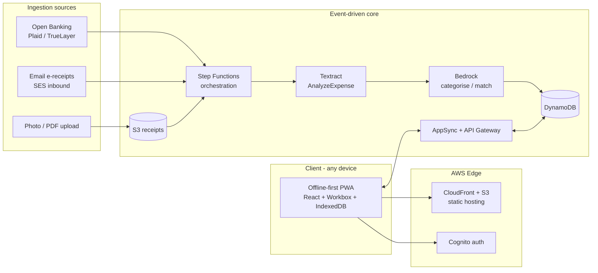

# AutoExpense

**Automated receipt-to-expense pipeline, built entirely on AWS serverless services.**

AutoExpense removes the manual work from expense reporting. Receipts are captured
automatically from the sources that *can* legally and technically be automated
(linked bank/card transactions via Open Banking, e-receipts sent by email, and an
OCR fallback for paper). They are extracted, categorised, matched against an expense
policy, and submitted — with the user reviewing only the exceptions.

It is delivered as an installable, offline-capable Progressive Web App (PWA) so it
runs on any device with no install step, and keeps working with no connection.

> This repository is built as a portfolio / CV project. The documentation is written
> to demonstrate *why* each AWS service was chosen, not just that it was used.

---

## What makes this interesting (the elevator pitch)

- **Event-driven, fully serverless** — no servers to manage, scales to zero, pay-per-use.
- **Purpose-built AI** — Amazon Textract `AnalyzeExpense` is designed specifically for
  receipts/invoices; Amazon Bedrock handles fuzzy categorisation and policy matching.
- **Offline-first** — AWS AppSync + DataStore give automatic, conflict-resolved sync,
  so the app is usable on a plane and reconciles itself on landing.
- **Honest data sourcing** — see [`docs/DATA-SOURCES.md`](docs/DATA-SOURCES.md) for the
  real-world constraints around Apple Pay / Google Pay and how this design works around them.

---

## Documentation

| Document | What's inside |
|----------|---------------|
| [`docs/ARCHITECTURE.md`](docs/ARCHITECTURE.md) | The master architecture diagram and end-to-end request/data flows. |
| [`docs/AWS-SERVICES.md`](docs/AWS-SERVICES.md) | An extensive, per-service deep dive — what each service does, why it was chosen, and a mini diagram of its role. |
| [`docs/DATA-SOURCES.md`](docs/DATA-SOURCES.md) | The honest reality of automatic receipt capture, including why Apple/Google Pay can't be read directly and what we do instead. |

---

## High-level architecture



See [`docs/ARCHITECTURE.md`](docs/ARCHITECTURE.md) for the full, detailed version.

---

## Repository layout

```
autoexpense/
├── docs/                 # Architecture, service & cost documentation (start here)
├── web/                  # Frontend PWA — React + Vite + TS, offline-first (IndexedDB)
├── infra/                # AWS CDK infrastructure-as-code (the whole serverless stack)
└── services/             # Lambda handlers for the extract → enrich → match → submit pipeline
```

## Getting started

Prereqs: Node 20+, an AWS account (only needed to deploy), and the AWS CLI configured.

```bash
npm install            # installs all three workspaces

# Run the PWA locally (works fully offline with seeded sample data)
npm run dev:web        # http://localhost:5180

# Type-check / build everything
npm run build:web
npm run build:services
npm run synth          # synthesize the CloudFormation for the AWS stack
```

### Deploying the backend

```bash
# one-time per account/region
npx cdk bootstrap --cwd infra

# deploy (optionally wire the budget alarm to your email)
npm run deploy --workspace @autoexpense/infra -- -c notifyEmail=you@example.com
```

The stack outputs the CloudFront URL, AppSync GraphQL URL, Cognito IDs, and bucket/table
names. The **email-first ingestion path** (S3 → EventBridge → Step Functions → Lambdas →
DynamoDB) is wired end-to-end; SES inbound rules require a verified domain and are the next
step to enable.

## Status

✅ Documentation, offline-first PWA, CDK infrastructure, and the processing pipeline are
scaffolded and build/synthesize cleanly.

**Not yet wired (good next steps):**
- Frontend ↔ AppSync: the PWA currently uses its local IndexedDB store; swapping in an
  AppSync-backed repository (the interface is already in place) turns on cloud sync.
- SES inbound receipt rule (needs a verified domain).
- Cognito hosted UI + Google/Apple federation on the frontend.
- Open Banking (Plaid/TrueLayer) connector Lambda.
- CI/CD (GitHub Actions → `cdk deploy`).
