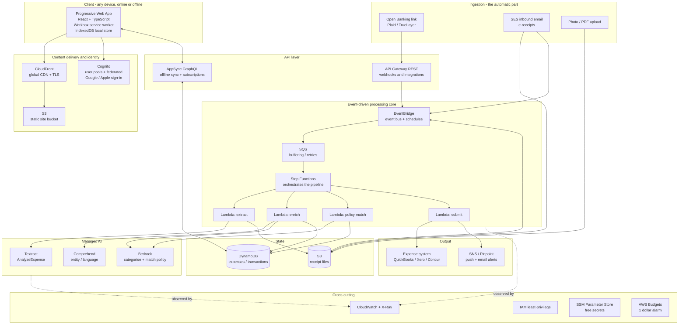
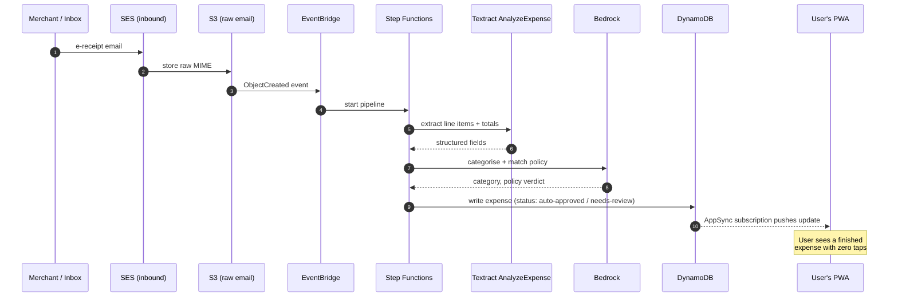
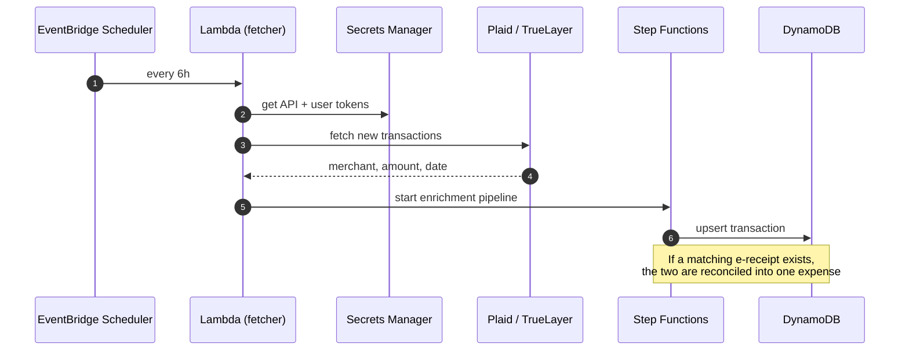
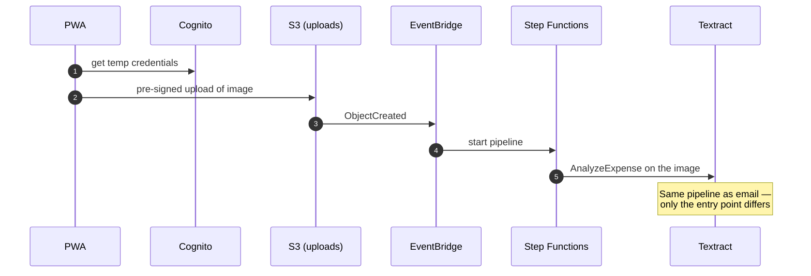
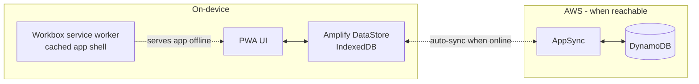

# AutoExpense — Architecture

This document explains *how the whole system fits together*. For a deep dive on each
individual AWS service (what it is, why it was chosen, and its specific role here), see
[`AWS-SERVICES.md`](AWS-SERVICES.md).

All diagrams are written in **Mermaid**, which GitHub renders natively — so they stay
in version control next to the code instead of going stale in a slide deck.

---

## 1. Design principles

Three principles drive every choice below.

1. **Serverless and event-driven.** There are no servers to patch or scale. Work happens
   in response to events (a receipt arrives, a transaction is fetched), so the system
   costs almost nothing when idle and scales automatically under load.
2. **Use purpose-built services over general-purpose code.** Reading a receipt is a solved
   problem — Amazon Textract `AnalyzeExpense` does it better than any regex we could write.
   We lean on managed AI rather than reinventing it.
3. **Offline-first, not offline-bolted-on.** The client owns a local copy of the data and
   treats the network as an enhancement. Sync and conflict resolution are handled by the
   platform (AppSync + DataStore), not hand-rolled.

---

## 2. The master diagram

---

## 3. End-to-end flows

The system has three ingestion paths that converge on one processing pipeline.
Showing them as sequence diagrams makes the runtime behaviour concrete.

### 3.1 Email e-receipt (the closest thing to "do nothing")

The user sets up auto-forwarding (or the merchant sends) e-receipts to a unique
address like `u-8a3f@inbox.autoexpense.app`. From there it's fully automatic.

### 3.2 Open Banking transaction sync

### 3.3 Photo / PDF fallback

---

## 4. Offline mode (the paid tier)

The free tier is online. The paid **"Offline Pro"** tier turns on full offline-first
behaviour. This is the realistic, defensible version of your "works on a plane / on the
same device" idea.

**What "offline" actually means here, precisely:**

- The **app shell** (HTML/CSS/JS) is cached by the service worker, so it opens with no network.
- **Data** lives locally in IndexedDB via DataStore. You can browse, edit, and add expenses offline.
- When connectivity returns, DataStore **syncs automatically** and resolves conflicts
  (last-writer-wins by default, customisable).
- **Why it's a paid tier:** offline ingestion needs more on-device work — local OCR
  (e.g. Tesseract WASM) so a receipt photo can be parsed without the cloud, larger local
  storage quotas, and background sync. That extra footprint and support cost is what the
  subscription covers.

> ⚠️ **On the original Bluetooth idea:** a web app cannot read a phone's wallet or another
> device's transactions over Bluetooth — the OS and Web Bluetooth security model don't
> allow it. The genuine version of "use it across my devices" is: install the PWA on each
> device under the same account; each device keeps its own offline copy and they reconcile
> through AppSync when any of them is online. See [`DATA-SOURCES.md`](DATA-SOURCES.md).

---

## 5. Why these choices (trade-offs in one place)

| Decision | Chosen | Considered instead | Why |
|----------|--------|--------------------|-----|
| Compute | Lambda | ECS/Fargate, EC2 | Spiky, event-driven workload; scale-to-zero; no ops. |
| API | AppSync (+ API Gateway for webhooks) | API Gateway only | AppSync gives offline sync + real-time subscriptions for free. |
| Orchestration | Step Functions | Chained Lambdas | Visual, retryable, auditable pipeline; no glue code. |
| Receipt OCR | Textract `AnalyzeExpense` | Rekognition + regex | Purpose-built for receipts/invoices; returns structured fields. |
| Categorisation | Bedrock (lazy) | Hard-coded rules | Rules + Comprehend run first; Bedrock is only called for low-confidence cases, so token spend stays near zero. |
| Database | DynamoDB | RDS/Aurora | Key-access patterns, serverless scaling, integrates with AppSync. |
| Hosting | S3 + CloudFront | Amplify Hosting | Cheap, global, fine-grained control; classic and well understood. |
| Secrets | SSM Parameter Store | Secrets Manager | Standard parameters are free; Secrets Manager is ~$0.40/secret/month. |
| Networking | No VPC | VPC + NAT Gateway | Everything is serverless, so we skip the ~$32/month NAT Gateway entirely. |
| IaC | AWS CDK (TypeScript) | SAM, Terraform | Same language as the app; type-safe; strong AWS-native story. |

> 💰 **Cost stance:** this architecture is designed to sit at or near $0 on the AWS Free Tier
> for personal/demo usage. The full reasoning, per-service cost table, and the budget-alarm
> setup live in [`COSTS.md`](COSTS.md).

---

## 6. Roadmap / open items

- [x] Scaffold `web/` — React + Vite PWA with Workbox and offline IndexedDB store.
- [x] Scaffold `infra/` — CDK app defining the stack (synthesizes cleanly).
- [x] Scaffold `services/` — Lambda handlers for extract / enrich / match / submit.
- [x] Define the DynamoDB single-table data model (`PK=USER#..`, `SK=EXPENSE#..`).
- [x] Wire the email/upload ingestion path end-to-end (S3 → EventBridge → Step Functions).
- [ ] Connect the PWA to AppSync (swap the local repository for the cloud one).
- [ ] Enable SES inbound rule (needs a verified domain).
- [ ] Add the Open Banking (Plaid/TrueLayer) connector Lambda.
- [ ] Add CI/CD (GitHub Actions → CDK deploy).

The email path is implemented first, since it's the most "magical" demo and is genuinely
hands-off.
