# AWS Services — Deep Dive

This is the "explain every service" document. Each entry follows the same shape so it's
easy to scan:

- **What it is** — a plain-English definition.
- **Why it's here** — the specific job it does in AutoExpense.
- **What makes it special for this use case** — the property that made it the right pick.
- **Diagram** — a focused mini-diagram of its role.

The services are grouped by the layer they live in. The master picture is in
[`ARCHITECTURE.md`](ARCHITECTURE.md).

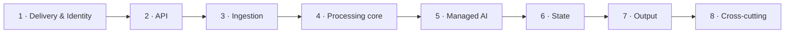

---

## 1 · Delivery & Identity

### Amazon S3 (static hosting)

**What it is.** Object storage. Here it holds the built web app (HTML/CSS/JS) as files.

**Why it's here.** The PWA is just static files. S3 stores them durably and cheaply, and
serves as CloudFront's origin.

**What makes it special for this use case.** Eleven-nines durability, effectively infinite
scale, and costs pennies. It also doubles (in a *separate* bucket) as the store for raw
receipt files and inbound emails — one service, two well-isolated jobs.

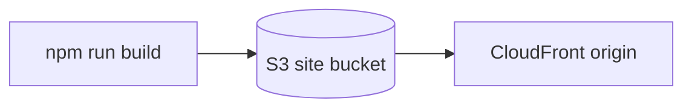

### Amazon CloudFront

**What it is.** A global content delivery network (CDN) with edge locations worldwide.

**Why it's here.** It serves the app from a location physically close to each user, terminates
HTTPS, and shields the S3 bucket (which is never public — access is via Origin Access Control).

**What makes it special for this use case.** "Auto-scaled to fit on all devices" starts with
fast global delivery. CloudFront also lets the app meet the PWA requirement of being served
over HTTPS everywhere, which service workers require.

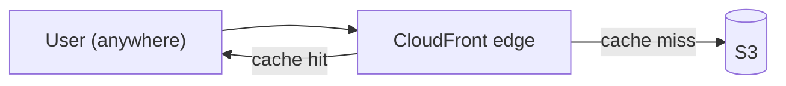

### Amazon Cognito

**What it is.** Managed user authentication and authorisation — user directories ("user pools")
and temporary AWS credentials ("identity pools").

**Why it's here.** It handles sign-up, sign-in, password resets, MFA, and federated login with
Google and Apple. It issues the JWTs that AppSync and API Gateway validate, and the temporary
credentials the PWA uses to upload receipts directly to S3.

**What makes it special for this use case.** You wanted Google/Apple sign-in — Cognito federates
those out of the box, so we never store passwords. It also ties cleanly into IAM so each user can
only ever touch their own data.

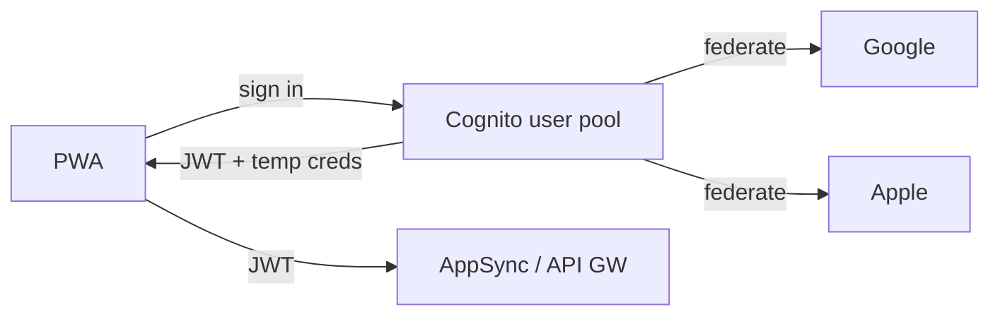

---

## 2 · API layer

### AWS AppSync (GraphQL)

**What it is.** A managed GraphQL service with built-in real-time subscriptions and an
offline data-sync engine (Amplify DataStore).

**Why it's here.** It's the primary API between the PWA and the backend. The client reads and
writes expenses through it, gets live updates via subscriptions (so a freshly-processed receipt
appears with no refresh), and — critically — uses DataStore for the offline tier.

**What makes it special for this use case.** This single choice delivers two of your headline
requirements almost for free: **real-time updates** ("the expense just appeared") and
**offline-first sync** ("works on a plane, reconciles later"). Hand-rolling conflict resolution
is a classic source of bugs; AppSync owns it.

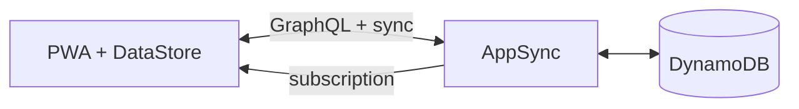

### Amazon API Gateway (REST)

**What it is.** A managed front door for HTTP APIs, with throttling, auth, and validation.

**Why it's here.** Some callers aren't your app and don't speak GraphQL — namely **webhooks**
from Plaid/TrueLayer and the expense-system integrations. API Gateway gives those a stable,
secured REST endpoint that forwards into the event bus.

**What makes it special for this use case.** It cleanly separates *partner/webhook traffic*
(REST, API Gateway) from *user traffic* (GraphQL, AppSync), so each is secured and scaled
on its own terms.

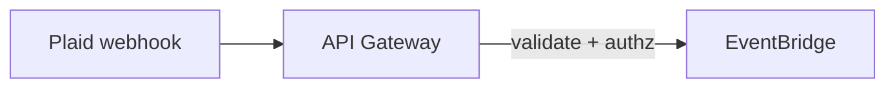

---

## 3 · Ingestion

### Amazon SES (inbound email)

**What it is.** Simple Email Service — sends *and receives* email. We use the inbound side.

**Why it's here.** This is the engine of the "do nothing" experience. Each user gets a unique
inbox address; e-receipts forwarded there are received by SES, dropped into S3, and trigger the
pipeline. No photo, no upload.

**What makes it special for this use case.** It's the only ingestion path that is both fully
automatic *and* gives full itemised receipts. Receive rules can store the raw MIME to S3 and
fire an event in one step.

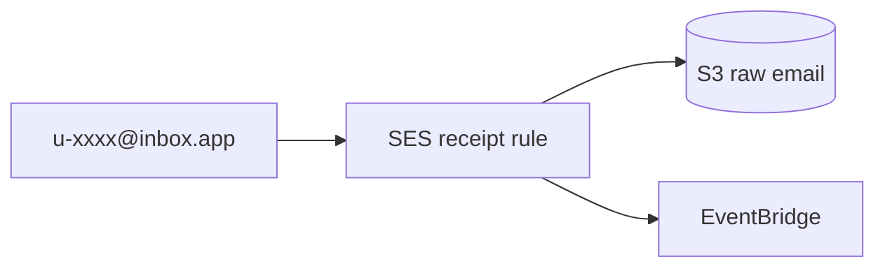

### Open Banking connector (Plaid / TrueLayer via Lambda)

**What it is.** Third-party aggregators (not AWS services) that, with user consent, return
bank/card transactions through a regulated Open Banking API. Called from a Lambda.

**Why it's here.** This is the realistic substitute for "read my Apple/Google Pay." It links the
*account behind* the wallet and pulls transactions automatically on a schedule.

**What makes it special for this use case.** It's consented, regulated, and bank-agnostic. It
won't give line items (banks don't have them), but it captures *every* card spend so nothing is
missed — and it reconciles against email receipts when both exist. See
[`DATA-SOURCES.md`](DATA-SOURCES.md) for why this beats trying to read the wallet directly.

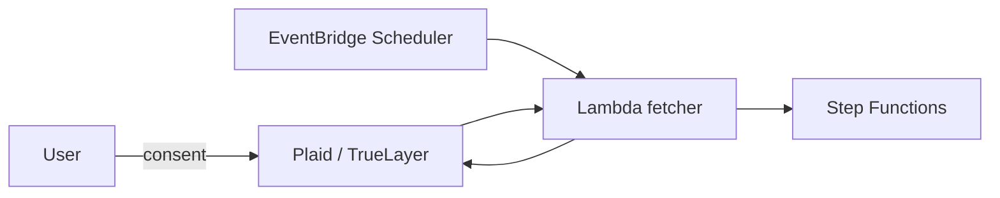

---

## 4 · Processing core

### Amazon EventBridge

**What it is.** A serverless event bus, plus a scheduler.

**Why it's here.** It's the nervous system. Every ingestion source emits an event onto the bus
(`receipt.received`, `transaction.fetched`, `upload.created`), and rules route them to the
pipeline. The scheduler triggers the periodic Open Banking pulls.

**What makes it special for this use case.** It decouples producers from consumers. Adding a new
receipt source later means emitting one more event type — nothing downstream changes. That's the
event-driven design principle made real.

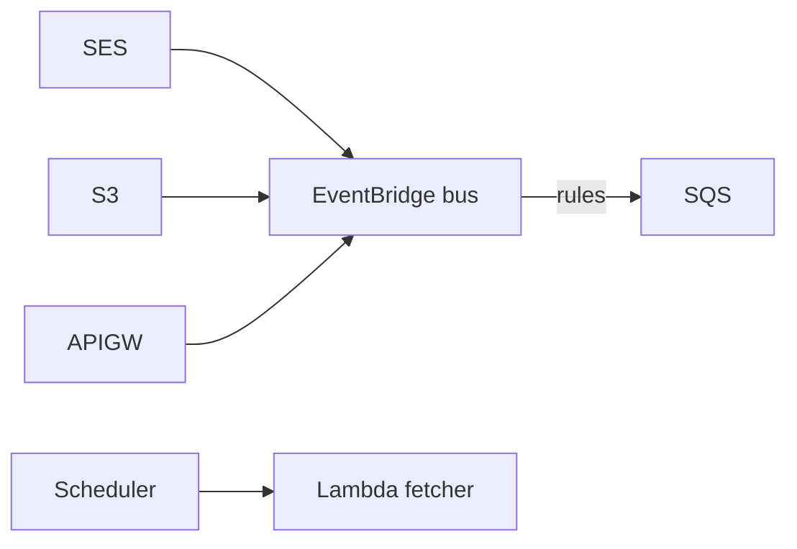

### Amazon SQS

**What it is.** A managed message queue with retries and dead-letter queues.

**Why it's here.** It buffers work between the event bus and the pipeline, so a burst of receipts
(e.g. a month of expenses uploaded at once) is absorbed smoothly, and transient failures retry
instead of getting lost.

**What makes it special for this use case.** Receipts must never be dropped. A dead-letter queue
guarantees that anything which repeatedly fails to process is parked for inspection, not silently
discarded — important when the data is someone's money.

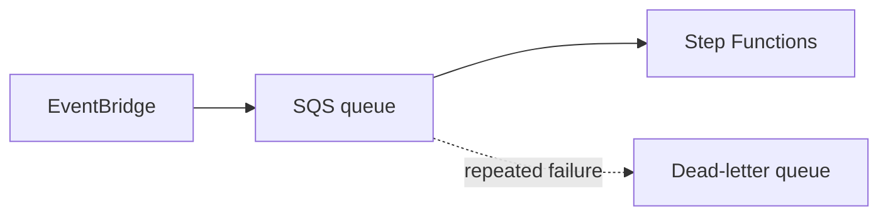

### AWS Step Functions

**What it is.** A managed workflow orchestrator that runs a state machine of steps with built-in
retries, branching, and error handling.

**Why it's here.** It runs the actual pipeline: **extract → enrich → match policy → submit**. Each
step is a Lambda, but the *flow* — including "if confidence is low, route to human review" — lives
in the state machine, not buried in code.

**What makes it special for this use case.** The pipeline becomes a picture you can audit and
replay. When an expense fails, you can see exactly which step failed and why — invaluable for both
debugging and for explaining the system in an interview.

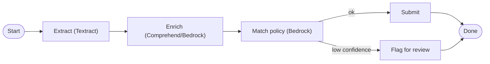

### AWS Lambda

**What it is.** Functions that run on demand with no server management; you pay per millisecond.

**Why it's here.** It's the glue and the logic for every step: parsing emails, calling Plaid,
invoking Textract/Bedrock, writing to DynamoDB, calling the expense system.

**What makes it special for this use case.** The workload is bursty and event-driven — perfect for
Lambda's scale-to-zero model. Idle cost is essentially nothing, and a sudden spike of 500 receipts
just runs 500 concurrent invocations.

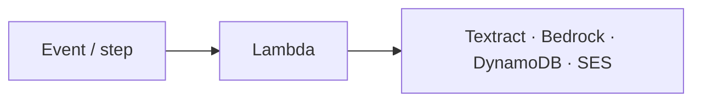

---

## 5 · Managed AI

### Amazon Textract — `AnalyzeExpense`

**What it is.** A document-AI service. The `AnalyzeExpense` API is a specialised mode built
specifically for **receipts and invoices**.

**Why it's here.** It turns a receipt image/PDF into structured data — vendor, date, total, tax,
and line items — without any template per merchant.

**What makes it special for this use case.** This is the single most "right tool for the job" pick
in the whole system. Generic OCR gives you a blob of text you then have to parse; `AnalyzeExpense`
returns *labelled* fields (`TOTAL`, `VENDOR_NAME`, line items) directly. It's the difference
between reading a receipt and understanding one.

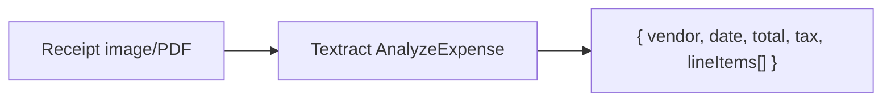

### Amazon Comprehend

**What it is.** A natural-language-processing service for entity extraction, language detection,
and classification.

**Why it's here.** Lightweight enrichment: detect the language of an e-receipt, pull out entities
(merchant, location), and do fast first-pass classification before the heavier Bedrock step.

**What makes it special for this use case.** It's cheap and quick for the structured 80% of cases,
reserving the pricier LLM for the genuinely ambiguous ones. Right-sizing the AI to the problem.

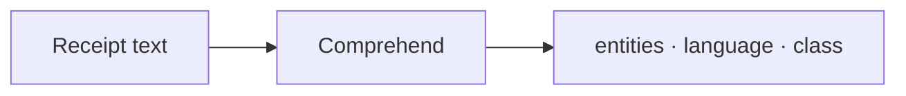

### Amazon Bedrock

**What it is.** Managed access to foundation models (LLMs) behind one API.

**Why it's here.** The hard, fuzzy decisions: mapping a cryptic merchant string like
`SQ *BLUE BOTTLE 0421` to a category, and judging a receipt against a natural-language expense
policy ("meals under £30, no alcohol"). It also drafts the human-readable expense description.

**What makes it special for this use case.** Real receipts are messy in ways rules can't anticipate.
An LLM generalises across that mess, and Bedrock provides it without managing any model
infrastructure — and keeps data within your AWS account boundary.

> 💰 **Cost tweak — lazy invocation.** Bedrock has no free tier, so it is called *last and least*.
> A cheap rules table plus Comprehend handles the common, unambiguous cases for free; Bedrock is
> only invoked when confidence is below a threshold. This keeps token spend near zero while still
> handling the hard cases well. See [`COSTS.md`](COSTS.md).

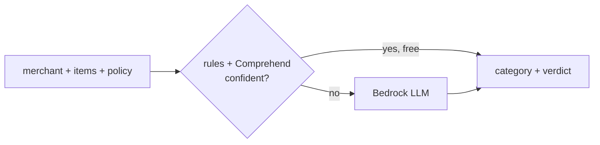

---

## 6 · State

### Amazon DynamoDB

**What it is.** A serverless NoSQL key-value/document database with single-digit-millisecond reads.

**Why it's here.** It's the source of truth for transactions and expenses. AppSync resolves directly
against it, and the pipeline writes results to it.

**What makes it special for this use case.** Access patterns are simple and known ("all expenses for
this user, newest first"), which is exactly DynamoDB's sweet spot. It scales automatically, costs
nothing at rest with on-demand mode, and pairs natively with AppSync for the offline-sync story.

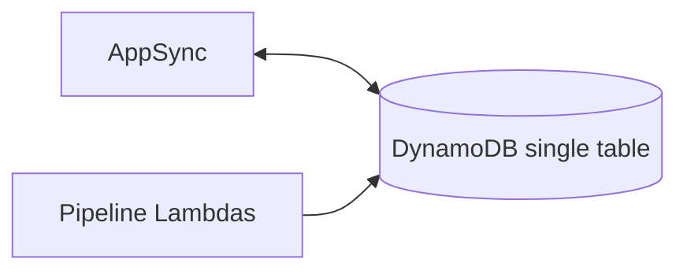

### Amazon S3 (receipt & email store)

**What it is.** The same object storage as the hosting bucket, in a separate, private bucket.

**Why it's here.** Raw artefacts — uploaded photos, PDFs, and inbound MIME emails — are large and
binary, which doesn't belong in a database. S3 holds them; DynamoDB holds a pointer.

**What makes it special for this use case.** Lifecycle rules can auto-archive old receipts to
cheaper storage (Glacier) for the multi-year retention that expense records legally require, with
no code.

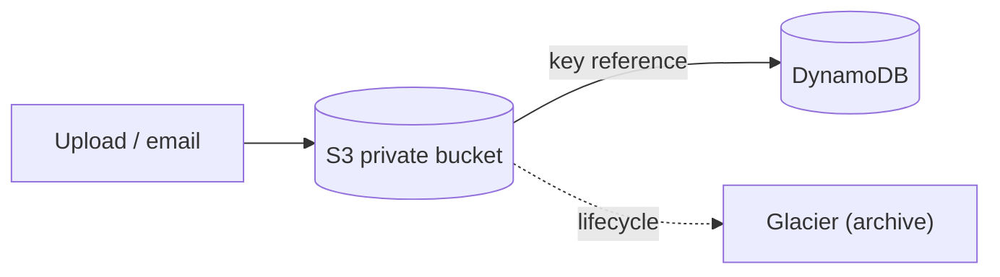

---

## 7 · Output

### Amazon SNS / Amazon Pinpoint

**What it is.** SNS is pub/sub notifications; Pinpoint adds user-facing push, email, and SMS
campaigns with engagement tracking.

**Why it's here.** To tell the user the few things they actually need to know: "3 expenses
submitted," or "1 receipt needs your review." Push notifications also support the PWA experience.

**What makes it special for this use case.** The whole point is the user does almost nothing —
so notifications are the *only* routine touch-point. They have to be reliable and targeted, which
is exactly what these provide.

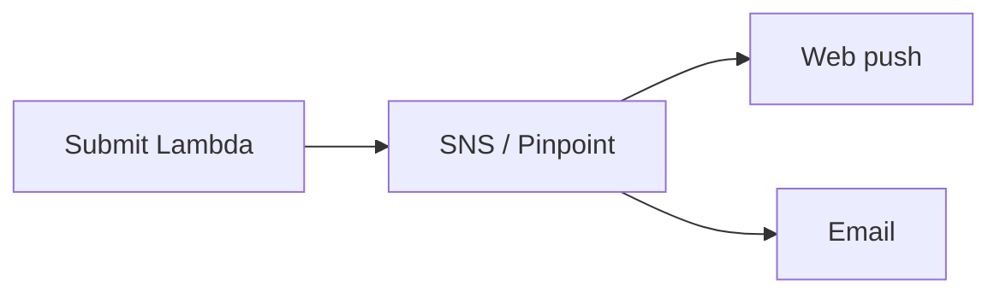

### Expense-system integration (QuickBooks / Xero / Concur)

**What it is.** Third-party accounting/expense platforms, called via their REST APIs from a Lambda.

**Why it's here.** "Submitting as an expense" ultimately means landing the record in the system the
user's employer actually uses. The submit step pushes the finished expense there.

**What makes it special for this use case.** It closes the loop — this is what makes the product
*finish the job* rather than just tidy receipts. Pluggable per provider behind one internal
interface.

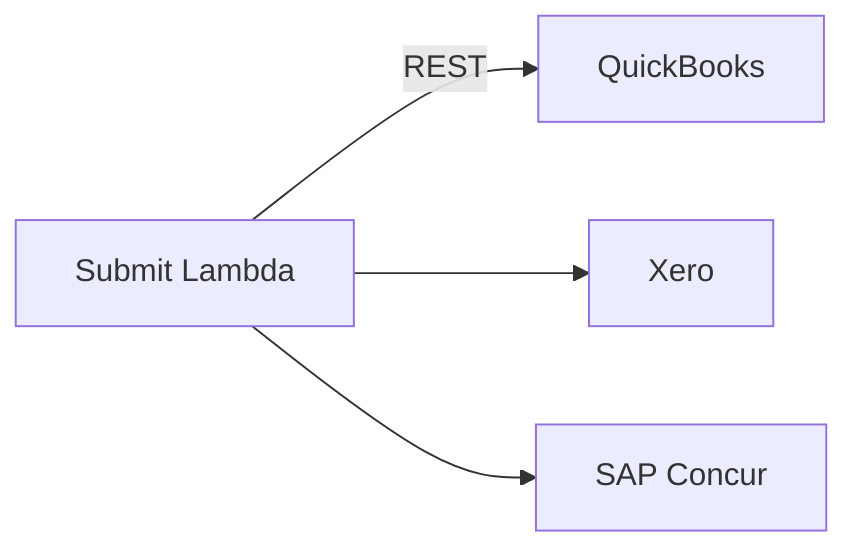

---

## 8 · Cross-cutting

### AWS IAM

**What it is.** Identity and Access Management — the permission system for everything in AWS.

**Why it's here.** Every Lambda, every bucket, every table is locked to least privilege. A user's
temporary credentials (from Cognito) can only reach *their* S3 prefix and *their* data.

**What makes it special for this use case.** The data is financial and personal. Least-privilege IAM
is the foundation that makes "user A can never see user B's receipts" a structural guarantee, not a
hopeful check in application code.

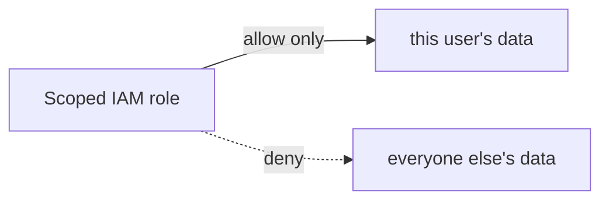

### AWS Systems Manager Parameter Store

**What it is.** Hierarchical storage for configuration and secrets. Standard parameters are
**free**; values can be encrypted with KMS.

**Why it's here.** Plaid/TrueLayer keys, expense-system OAuth tokens, and per-user access tokens
live here — never in code or environment variables checked into Git.

**What makes it special for this use case.** It does the same secrets job as AWS Secrets Manager
but **standard parameters cost nothing**, where Secrets Manager is ~$0.40 per secret per month.
For a free-tier portfolio project that's the right trade — and swapping to Secrets Manager later
(for automatic rotation) is a one-line change. A public CV repo with a leaked Plaid key is a
disaster; Parameter Store keeps credentials out of the codebase entirely.

```mermaid
flowchart LR
    L["Lambda"] -->|fetch at runtime| SSM["SSM Parameter Store (free)"]
    SSM --> Keys["Plaid key · OAuth tokens"]
```

### Amazon CloudWatch + AWS X-Ray

**What it is.** CloudWatch is logs, metrics, and alarms; X-Ray is distributed tracing.

**Why it's here.** Logs from every Lambda, metrics on queue depth and pipeline failures, alarms when
something breaks, and an X-Ray trace following one receipt across SES → Step Functions → Textract →
DynamoDB.

**What makes it special for this use case.** In an event-driven system the logic is spread across
many small pieces. Tracing is what lets you answer "where did *this* receipt go?" — essential for
operating it and for demonstrating production-readiness on your CV.

```mermaid
flowchart LR
    Pipe["All services"] --> CW["CloudWatch logs/metrics"]
    CW --> AL["Alarms"]
    Pipe --> XR["X-Ray trace (one receipt)"]
```

### AWS CDK (infrastructure-as-code)

**What it is.** The Cloud Development Kit — define AWS infrastructure in TypeScript and synthesise
it to CloudFormation.

**Why it's here.** Every resource above is declared in code under `infra/`, so the whole stack is
versioned, reviewable, and reproducible with one `cdk deploy`.

**What makes it special for this use case.** For a portfolio project this is huge: a reviewer can read
your infrastructure like code, and anyone can stand up the entire system from scratch. It's the
difference between "I clicked around the console" and "here's my reproducible architecture."

```mermaid
flowchart LR
    TS["CDK (TypeScript)"] --> CFN["CloudFormation"]
    CFN --> AWS["All AWS resources"]
```

---

## Service summary table

| # | Service | Layer | One-line role |
|---|---------|-------|---------------|
| 1 | S3 | Delivery / State | Host the app; store receipts & emails. |
| 2 | CloudFront | Delivery | Fast, secure global delivery of the PWA. |
| 3 | Cognito | Identity | Sign-in incl. Google/Apple; issues JWTs & temp creds. |
| 4 | AppSync | API | GraphQL API with real-time + offline sync. |
| 5 | API Gateway | API | REST front door for webhooks/integrations. |
| 6 | SES | Ingestion | Receive e-receipts by email (the automatic path). |
| 7 | EventBridge | Core | Event bus + scheduler tying sources to pipeline. |
| 8 | SQS | Core | Buffer & retry so no receipt is ever lost. |
| 9 | Step Functions | Core | Orchestrate extract → enrich → match → submit. |
| 10 | Lambda | Core | All compute / glue / logic. |
| 11 | Textract `AnalyzeExpense` | AI | Structured receipt extraction. |
| 12 | Comprehend | AI | Cheap NLP enrichment / first-pass classification. |
| 13 | Bedrock | AI | Fuzzy categorisation & policy matching. |
| 14 | DynamoDB | State | Source of truth for transactions/expenses. |
| 15 | SNS / Pinpoint | Output | Notify the user of the few things that matter. |
| 16 | IAM | Cross-cutting | Least-privilege isolation of each user's data. |
| 17 | SSM Parameter Store | Cross-cutting | Keep third-party keys out of the codebase — for free. |
| 18 | CloudWatch + X-Ray | Cross-cutting | Observability & end-to-end tracing. |
| 19 | CDK | Cross-cutting | Reproducible infrastructure-as-code. |
