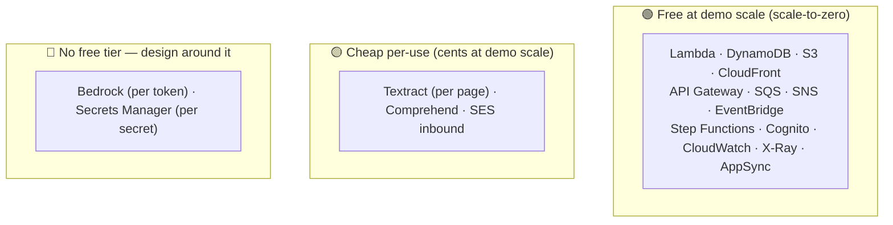

# Costs — staying on the AWS Free Tier

**Goal:** build, deploy, and demo AutoExpense for **$0–a few dollars**. This document is the
cost story — useful for running the project cheaply *and* as a talking point that shows
cost-awareness to a reviewer.

> ⚠️ Prices and free-tier terms change. Treat the numbers here as "order of magnitude" and
> always confirm against the live [AWS pricing pages](https://aws.amazon.com/pricing/) and your
> own **AWS Budgets** alarm. Figures below reflect general public pricing at time of writing and
> are paraphrased for licensing compliance.

---

## 1. The new-account credit window

New AWS accounts (created after 15 July 2025) start on a **Free Plan**: **$100 in credits up
front, plus up to $100 more** for trying foundational services — up to **$200 over ~6 months**
([aws.amazon.com/free](https://aws.amazon.com/free/)). That window comfortably absorbs the small
per-use costs of building and demoing this project.

After the window, the design below keeps a low-traffic / personal deployment at or near $0 because
every component is serverless and scales to zero when idle.

---

## 2. Cost buckets



### 🟢 Free at demo scale
Serverless services that cost effectively nothing when idle and stay within generous allowances
for a single-user demo: **Lambda, DynamoDB, S3, CloudFront, API Gateway, SQS, SNS, EventBridge,
Step Functions, Cognito, CloudWatch, X-Ray, AppSync**.

### 🟡 Cheap per-use
- **Textract** — billed per page; `AnalyzeExpense` is one of the pricier features (roughly a cent
  and up per page). A demo processes a handful of pages = cents.
- **Comprehend** — small per-unit cost; trivial at demo volume.
- **SES inbound** — fractions of a cent per received email.

### 🔴 No free tier — the cost drivers
- **Amazon Bedrock** — no free tier, pay per token.
- **AWS Secrets Manager** — ~$0.40 per secret per month.

---

## 3. The tweaks applied to this project

These are baked into the architecture and the code, not optional add-ons.

| # | Tweak | Effect |
|---|-------|--------|
| 1 | **Secrets Manager → SSM Parameter Store** (standard tier) | Removes the ~$0.40/secret/month recurring charge — Parameter Store standard parameters are free. |
| 2 | **Lazy Bedrock** | Rules + Comprehend handle confident cases for free; Bedrock is only called when confidence is low. Token spend stays near zero. |
| 3 | **Email-first ingestion** | Parsing structured e-receipt emails is plain Lambda work — no Textract page charges. Textract is reserved for actual image uploads. |
| 4 | **No VPC / no NAT Gateway** | Everything is serverless, so we avoid the classic ~$32/month NAT Gateway free-tier killer entirely. |
| 5 | **Budget alarm** | An AWS Budgets alarm at a low threshold guarantees no surprise bills. |
| 6 | **Scale-to-zero everywhere** | DynamoDB on-demand, Lambda, AppSync — no always-on resources, so idle cost ≈ $0. |

---

## 4. Set up the safety-net budget alarm

Run this once after configuring the AWS CLI. It creates a $1/month budget that emails you at 80%
and 100% of actual spend. Replace the email address first.

```bash
aws budgets create-budget \
  --account-id "$(aws sts get-caller-identity --query Account --output text)" \
  --budget '{
    "BudgetName": "autoexpense-monthly",
    "BudgetLimit": { "Amount": "1", "Unit": "USD" },
    "TimeUnit": "MONTHLY",
    "BudgetType": "COST"
  }' \
  --notifications-with-subscribers '[
    {
      "Notification": { "NotificationType": "ACTUAL", "ComparisonOperator": "GREATER_THAN", "Threshold": 80 },
      "Subscribers": [ { "SubscriptionType": "EMAIL", "Address": "you@example.com" } ]
    },
    {
      "Notification": { "NotificationType": "ACTUAL", "ComparisonOperator": "GREATER_THAN", "Threshold": 100 },
      "Subscribers": [ { "SubscriptionType": "EMAIL", "Address": "you@example.com" } ]
    }
  ]'
```

> The CDK app also defines this budget as code (see `infra/`), so it's created automatically on
> deploy. The CLI version above is a manual fallback / for accounts where you want it before the
> first deploy.

---

## 5. Bottom line

- **Building + demoing:** fits in the Free Tier / credit window. Expect $0–a few dollars.
- **The only real cost drivers** (Bedrock, Secrets Manager) are designed around — lazy Bedrock and
  Parameter Store mean a personal deployment stays at or near $0.
- **Production at scale** would cost money (Textract per page, Bedrock per token, AppSync/DynamoDB
  beyond free limits) — but that's a good problem and a separate conversation.
