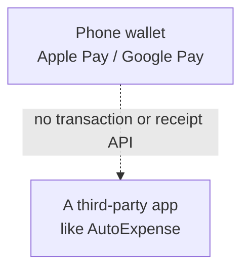
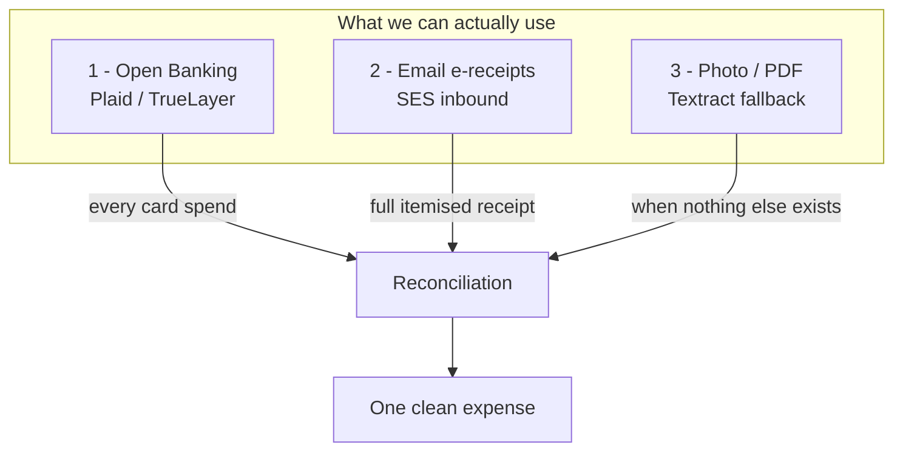
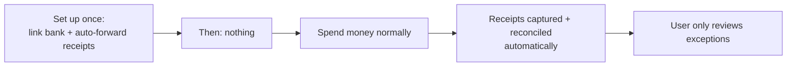
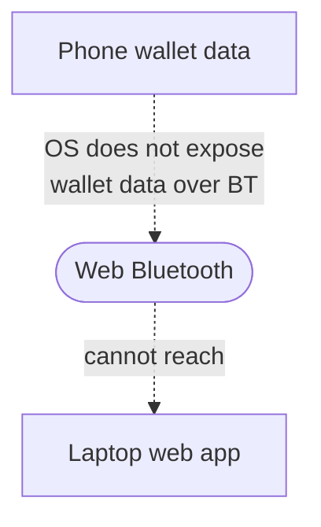

# Data Sources — the honest reality of "automatic" receipt capture

The original vision was: *link Apple Pay / Google Pay, and the app reads each e-receipt the
moment a payment is made — the user does nothing, not even take a photo.*

It's a great goal, and the product is designed to get **as close to it as is actually possible.**
But part of building something CV-worthy is knowing — and being able to explain — where the hard
constraints are. This document is the answer you'd give when an interviewer asks
*"so how do you actually get the data?"*

---

## 1. Why you can't read Apple Pay / Google Pay directly

- **Apple Pay.** Apple exposes **no API** that lets a third-party app read a user's Apple Pay
  transactions or the receipts behind them. Transaction data stays between the user, their bank,
  and Apple. (Apple's developer APIs are for *accepting* Apple Pay as a merchant, not reading a
  consumer's history.)
- **Google Pay.** Google historically had a transactions/passes surface, but consumer
  transaction-history access for third parties is restricted and not a general-purpose feed you
  can build a product on.
- **The underlying reason** is privacy and the payment-network rules (PCI, card-scheme
  agreements). A tap-to-pay token deliberately does *not* carry an itemised receipt to third
  parties.

So "link the wallet, read the receipts" is not buildable on public, supported APIs. Anyone who
claims otherwise is either a merchant integration, a screen-scraper (fragile and often against
ToS), or relying on the user manually sharing data.

---

## 2. What we do instead — three real, layered sources

The trick is to combine sources so that, *together*, they approximate "automatic" while each one
stands on supported, consented ground.

| Source | Automatic? | Gives line items? | Coverage | Consent basis |
|--------|-----------|-------------------|----------|---------------|
| ① Open Banking | ✅ Yes, on a schedule | ❌ No (banks don't have them) | Every card transaction | Regulated, user-consented |
| ② Email e-receipts | ✅ Yes, on arrival | ✅ Yes, full detail | Only merchants that email receipts | User sets up forwarding |
| ③ Photo / PDF | ⚠️ One action by user | ✅ Yes | Anything physical | N/A |

**The key insight (and the good interview answer):** Open Banking guarantees *nothing is missed*
(it sees every card spend), and email receipts add the *rich detail* where available. The
reconciliation step matches an Open Banking transaction to its email receipt by merchant + amount +
date, producing one complete expense. Photo upload is only needed for the shrinking tail of
cash/paper receipts.

---

## 3. How close does this get to "do nothing"?

- **One-time setup:** the user links their bank (a few taps, via Plaid/TrueLayer's secure flow)
  and sets a mail rule to auto-forward receipts to their AutoExpense address.
- **After that:** genuinely hands-off for any spend that hits the linked card and/or emails a
  receipt. The user is only pulled in to confirm low-confidence matches or policy exceptions.

That's the realistic version of your vision — and it's arguably a *better* product, because it
also captures spends the wallet never would (e.g. a card kept in a drawer, a recurring online
subscription).

---

## 4. On the "Bluetooth between phone and laptop" idea

Web Bluetooth lets a web app talk to **BLE peripherals** (heart-rate monitors, beacons, custom
hardware). It **cannot** read another device's payment/wallet data — the phone OS doesn't expose
that to anything, over any transport. So this specific mechanism isn't viable.

**The real way to "use it across my devices":**

- Install the PWA on each device under the same account.
- Each device keeps its own **offline copy** (IndexedDB via Amplify DataStore).
- Whenever *any* device is online, it syncs through AppSync, so they all converge.

That delivers the actual goal — your data is available and editable on every device, online or
off — using a mechanism that genuinely works. The offline behaviour is the paid **"Offline Pro"**
tier described in [`ARCHITECTURE.md`](ARCHITECTURE.md#4-offline-mode-the-paid-tier).

---

## 5. Summary

- ❌ Reading Apple/Google Pay receipts directly — **not possible** on supported APIs.
- ❌ Reading wallet data over Bluetooth — **not possible**; the OS forbids it.
- ✅ Open Banking + email receipts + OCR fallback — **fully buildable**, consented, and together
  approximate "automatic" while capturing *more* than the wallet ever could.
- ✅ Cross-device offline use via PWA + AppSync/DataStore — **fully buildable** and is the genuine
  version of the "same device / my devices" idea.

Being able to walk an interviewer through *this* table — the constraint, why it exists, and the
design that works around it — is worth more than a feature that doesn't exist.
